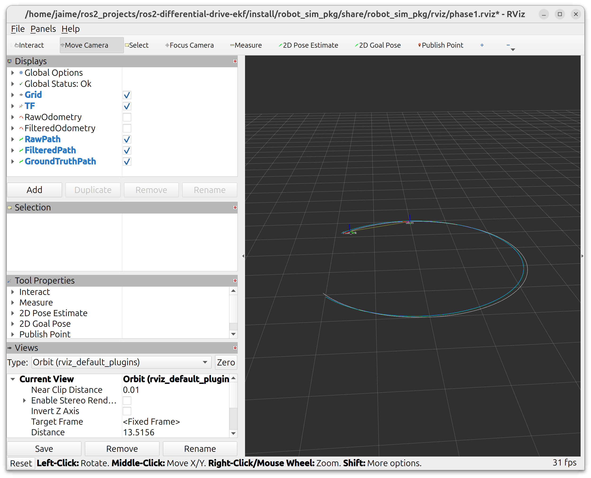
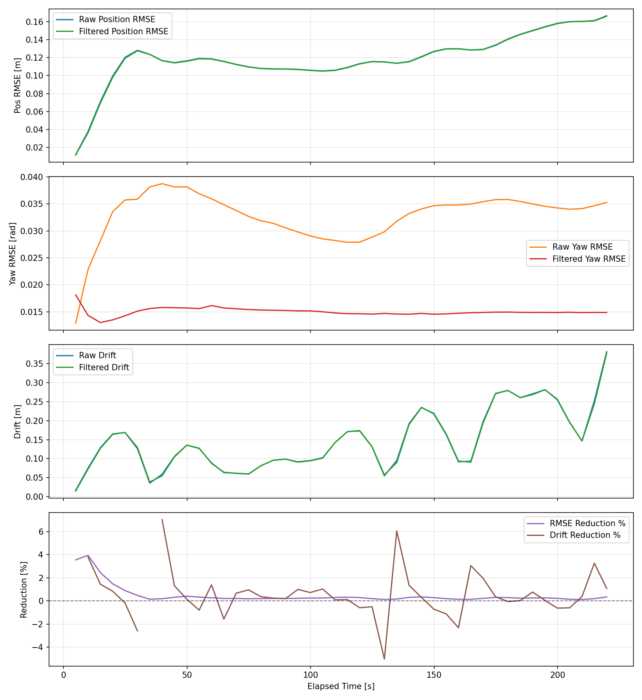
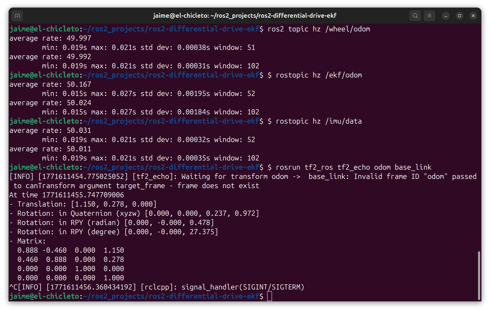
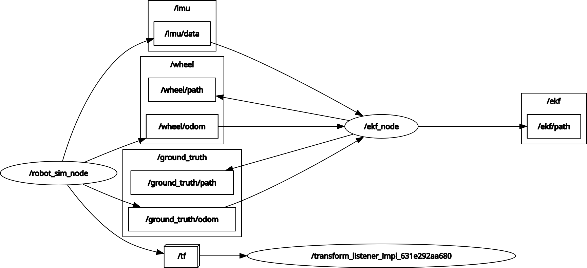
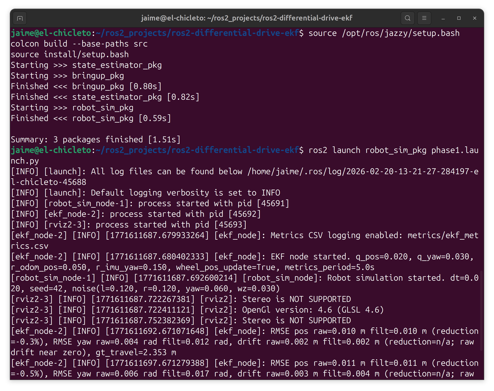

# ROS 2 Differential Drive EKF Workspace

This repository is a ROS 2 workspace for a simple differential-drive robot using:
- `robot_sim_pkg` for noisy differential-drive simulation, RViz config, and launch
- `state_estimator_pkg` for EKF fusion, filtered odometry, paths, and metrics logging
- `bringup_pkg` for minimal bringup package baseline

## Workspace Structure

```text
ros2-differential-drive-ekf/
├── src/
│   ├── robot_sim_pkg/
│   │   ├── launch/
│   │   ├── robot_sim_pkg/
│   │   └── rviz/
│   ├── state_estimator_pkg/
│   │   ├── state_estimator_pkg/
│   │   └── test/
│   └── bringup_pkg/
│       ├── bringup_pkg/
│       └── test/
├── tools/
├── build/      # generated
├── install/    # generated
└── log/        # generated
```



## Prerequisites

- Ubuntu with ROS 2 installed
- Tested on ROS 2 Jazzy
- `colcon` available
- ROS 2 packages used by this workspace:
  - `rclpy`
  - `nav_msgs`
  - `geometry_msgs`
  - `sensor_msgs`
  - `tf2_ros`
  - `launch`
  - `launch_ros`
  - `rviz2`
- Python dependencies:
  - `numpy`
  - optional: `matplotlib` (for plotting metrics CSVs)

## Build

Run from the workspace root:

```bash
source /opt/ros/jazzy/setup.bash
colcon build --base-paths src
source install/setup.bash
```

## Run

### 1. Full Simulation + EKF + RViz

```bash
source /opt/ros/jazzy/setup.bash
source install/setup.bash
ros2 launch robot_sim_pkg phase1.launch.py
```

This launch starts:
- `robot_sim_node` (ground truth + noisy wheel odometry + IMU)
- `ekf_node` (state estimation and metrics)
- `rviz2`

### 2. Run with Explicit Noise/Filter Parameters

```bash
source /opt/ros/jazzy/setup.bash
source install/setup.bash
ros2 launch robot_sim_pkg phase1.launch.py \
  left_wheel_noise_std:=0.18 right_wheel_noise_std:=0.18 \
  imu_yaw_noise_std:=0.08 imu_wz_noise_std:=0.04 \
  r_imu_yaw:=0.20 q_yaw:=0.02 \
  metrics_csv_path:=metrics/ekf_metrics.csv random_seed:=7
```

### 3. Plot EKF Metrics CSV (Optional)

```bash
python3 tools/plot_metrics.py metrics/ekf_metrics.csv --out metrics/ekf_metrics.png
```



## Useful Checks

```bash
ros2 topic hz /wheel/odom
ros2 topic hz /ekf/odom
ros2 topic hz /imu/data
ros2 run tf2_ros tf2_echo odom base_link
```



## Architecture View



## Reproducibility Snapshot



## Key Files

- Simulator entrypoint: `src/robot_sim_pkg/robot_sim_pkg/robot_sim_node.py`
- EKF entrypoint: `src/state_estimator_pkg/state_estimator_pkg/ekf_node.py`
- Main launch: `src/robot_sim_pkg/launch/phase1.launch.py`
- RViz config: `src/robot_sim_pkg/rviz/phase1.rviz`
- Metrics plotting utility: `tools/plot_metrics.py`

## Troubleshooting

- Launch or package changes not reflected:
  - Rebuild and re-source:
    ```bash
    colcon build --base-paths src
    source install/setup.bash
    ```

## Notes

- `.gitignore` excludes generated ROS 2 workspace artifacts (`build/`, `install/`, `log/`) and editor/system files.
- Recommended README image assets to add:
  - `docs/assets/images/ekf_rviz_paths.png`
  - `docs/assets/images/ekf_metrics_plot.png`
  - `docs/assets/images/topics_check_terminal.png`
  - `docs/assets/images/arch_node_graph.png`
  - `docs/assets/images/repro_build_steps.png`
