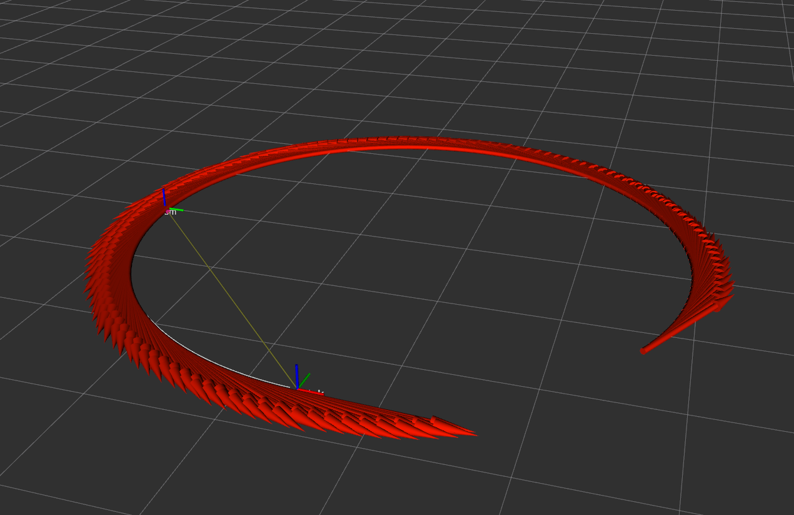
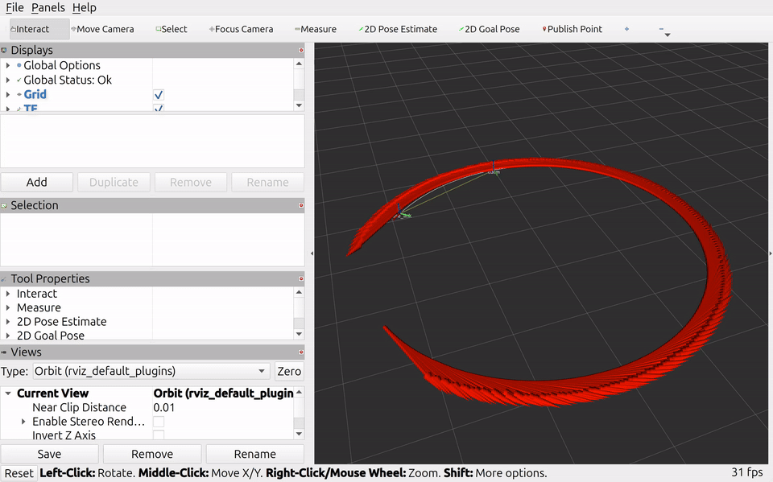

# ROS 2 Differential Drive EKF Portfolio

## Title
Differential-Drive Simulation with EKF State Estimation in ROS 2 (Jazzy)



## Problem Statement
This project studies how noisy wheel odometry can be improved with filtering in a ROS 2 simulation.

- `robot_sim_pkg` publishes ground truth, noisy wheel odometry, and IMU data.
- `state_estimator_pkg` runs an EKF and publishes filtered odometry and path topics.
- The project logs metrics to CSV so raw vs filtered behavior can be compared over time.
- The goal is not perfect localization, but measurable error behavior under noise.

## System Architecture
The main runtime flow is:

- `robot_sim_node` publishes `/ground_truth/odom`, `/wheel/odom`, `/imu/data`, and TF (`odom -> base_link`).
- `ekf_node` subscribes to wheel odometry + IMU yaw and publishes `/ekf/odom`.
- `ekf_node` also publishes `/wheel/path`, `/ekf/path`, and `/ground_truth/path`.
- RViz visualizes all paths and frames through `phase1.launch.py`.


## Technical Implementation
The workspace is organized as a ROS 2 source tree under `src/`:

- `src/robot_sim_pkg`: simulator node, launch file, RViz config.
- `src/state_estimator_pkg`: EKF node and metrics CSV writer.
- `src/bringup_pkg`: minimal package baseline node.
- `tools/plot_metrics.py`: converts CSV metrics into plots.

### Software Stack
- ROS 2 Jazzy
- Python ROS packages (`rclpy`, `nav_msgs`, `geometry_msgs`, `sensor_msgs`, `tf2_ros`)
- `launch` and `launch_ros`
- RViz2
- `numpy`
- `matplotlib` (for plotting script)

### Core Engineering Decisions
- Keep simulator and estimator in separate packages to isolate responsibilities.
- Use wheel odometry for prediction and IMU yaw for yaw correction in the EKF.
- Expose noise and EKF tuning parameters as launch arguments in `phase1.launch.py`.
- Save metrics as CSV (`metrics/ekf_metrics.csv`) for repeatable checks and plotting.
- Keep workspace and CI commands aligned to `colcon build/test --base-paths src`.

## Key Challenges and Solutions
- Challenge: generated metrics were easy to lose in `/tmp`.
  - Solution: default CSV path was moved to `metrics/ekf_metrics.csv` in the repo root.
- Challenge: quickly checking filter behavior from logs is hard.
  - Solution: `tools/plot_metrics.py` was expanded to plot RMSE, yaw RMSE, drift, and reductions.
- Challenge: project layout was not template-consistent.
  - Solution: migrated from `ros2_ws/src` to root `src/`, plus template-style CI and metadata files.

## Results
Current evidence from the existing CSV and plots:

- Raw and filtered position tracks are close in RViz, which is expected without an absolute position sensor.
- Yaw RMSE is clearly reduced by the EKF in the logged run.
- Position RMSE reduction is small but positive in the current tuning/noise setup.
- Drift reduction varies over time, with both positive and negative windows.


Optional run demo:



## Reproducibility
From the repository root:

```bash
source /opt/ros/jazzy/setup.bash
colcon build --base-paths src
source install/setup.bash
ros2 launch robot_sim_pkg phase1.launch.py
```

Run with explicit noise/filter parameters:

```bash
ros2 launch robot_sim_pkg phase1.launch.py \
  left_wheel_noise_std:=0.18 right_wheel_noise_std:=0.18 \
  imu_yaw_noise_std:=0.08 imu_wz_noise_std:=0.04 \
  r_imu_yaw:=0.20 q_yaw:=0.02 \
  metrics_csv_path:=metrics/ekf_metrics.csv random_seed:=7
```

Generate plot from CSV:

```bash
python3 tools/plot_metrics.py metrics/ekf_metrics.csv --out metrics/ekf_metrics_all.png
```

Key files for replication:
- `src/robot_sim_pkg/launch/phase1.launch.py`
- `src/robot_sim_pkg/robot_sim_pkg/robot_sim_node.py`
- `src/state_estimator_pkg/state_estimator_pkg/ekf_node.py`
- `src/robot_sim_pkg/rviz/phase1.rviz`
- `tools/plot_metrics.py`
- `.github/workflows/ci.yml`


## What to Improve
- Add at least one absolute position measurement source to better evaluate position correction.
- Add automated tests for EKF behavior (not just lint), e.g., expected RMSE reduction bounds.
- Save experiment metadata (parameter set, seed) together with each CSV file.
- Add a launch variant for multiple seeds and summary statistics across runs.
- Improve visuals by capturing and versioning real architecture and RViz screenshots in `docs/assets/`.
